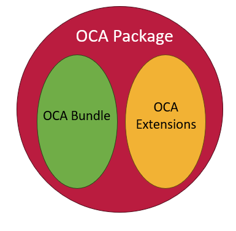
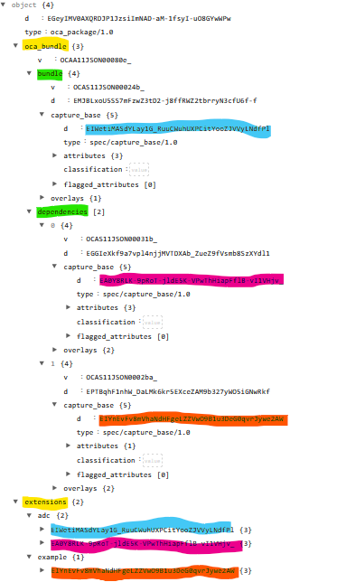

# OCA Package version 1.0

Overlays Capture Architecture (OCA) is a standardized language for describing data schemas.

Overlays Capture Architecture is optimized for overlays, where the community can improve the functionalities of a schema to meet their needs while maintaining interoperability.

OCA Package extends the functionality of OCA by specifying how new overlays created by communities can be added to OCA objects without disrupting those overlays that belong to the core specification. The core specification overlays remain in one object of OCA Package (`oca_bundle`) with a Self-addressing Identifier (SAID) calculated only from in-specification OCA overlays. Additional overlays that are not part of the core specfication are added to a second object (`extensions`) where their addition does not change the calculation of the SAID of the in-specification overlays. This helps with interoperability as different communities may not recognize each others community overlays, but all should recognize the in-specification overlays. The SAIDs of these in-specification overlays will therefore remain consistent across communities.

Figure 1: Conceptual structure of an OCA package which contains two objects - the official OCA specification schema, and the associated overlays that lie outside of the specification.

## Components of an OCA Package

OCA Package formalizes a way to develop, publish and use overlays that are outside of the OCA specification.

The OCA specification describes oca_bundle which collects a capture base and associated overlays into a single object. OCA Package describes how additional overlays outside of the official specification can be added to an OCA Schema without altering the oca_bundle object.

[Link to a fully worked example of an OCA Package.](example_package.json)

Figure 2: example oca_package structure. The top two divisions highlighted in yellow are: oca_bundle and extensions. oca_bundle is governed by the Human Colossus Foundation. Extensions syntax is described in this specification. According to OCA specification (v1.0.1) an oca_bundle is divided into bundle and dependencies. Both contain complete schemas where the bundle contains the root schema which MAY reference dependent schemas. Each schema contains a single capture_base with its own digest identifier (highlighted in blue, pink and orange). The extensions section contains two separate communities (adc and example), they contain overlays which are grouped together within the objects identified by their corresponding capture_base digest (blue, pink and orange). There can be no extensions referencing a capture_base that does not appear in the oca_bundle.

### OCA Bundle

The overlays and capture base of the [OCA Specification](http://oca.colossi.network/specification/) are contained in the oca_bundle object of an oca_package. The contents of oca_bundle are governed by the Human Colossus Foundation and documented into the official [OCA Specification](http://oca.colossi.network/specification/).

The SAID of any bundle when calculated only includes capture_base and OCA overlays documented by the official specification. A bundle can reference other bundles in a hierarchical fashion. The referenced schemas are found inside dependencies of an oca_bundle object. Dependencies only include official specification oca_bundles.

### Extension overlays

Extension within oca_package contains overlays developed by various communities. These overlays are outside of the governance of the Human Colossus Foundation and can be created by members of the community to meet their needs.
Community overlays are governed by their respective communities. A community can consist of one individual implementing a single project addressing a single need. A community can also be a large consortium of partners with their own governance structure for determining composition, versioning and acceptance of their community overlays. When present in an oca_package, community overlays MUST follow the OCA Package Design Requirements.

## Governance of OCA Package

The oca_package is under the governance of the OCA Package governance body.

The OCA Package governance body MUST maintain the official standard specification for oca_package and the OCA Package Design Requirements. OCA Community overlays MUST follow the OCA Package Design Requirements.

### Governance of OCA Package community names

Communities are free to establish and govern their own namespace within OCA Package. Communities must avoid collision within the namespace and ensure that their names are unique. Communities can request to register their unique name with the OCA Package governance body which lists accepted names here at the end of this specification. Provide the namespace name (no wildcards), source URL and email contact to register. These namespaces are recognized by the OCA Package community as privileged and exclusive to that community. Reserved namespaces include `internal*` where anyone can use names that begin with internal (such as internal-uog) to be used within private systems and `example` which can be used for examples similar to the usage of example.com.

### Promotion of overlays to official OCA Specification:

HCF maintains the official implementation the OCA specification. To become become part of the official OCA specification any overlay must go through the [official RFC process](https://github.com/the-human-colossus-foundation/oca-spec/blob/master/README.md).

## Technical Implementation of an OCA Package

Technical implementation of the OCA package is outside of the scope of the OCA Package governance body. Communities are expected to develop their own implementations.

The [ADC implementation can be found on npm](https://www.npmjs.com/package/oca_package).

# OCA Package Design Requirements

1. Community overlays MUST follow OCA Package Syntax Requirements
2. Documentation for Community overlays MUST be published publically and follow the OCA Package Overlay Documentation Requirements.
3. SAID calculations of the oca_package contents (excluding oca_bundle) follow requirements documented in [CESR Specification](https://trustoverip.github.io/tswg-cesr-specification/#self-addressing-identifier-said). This non-normative post [documents the process and design choices of the calculations of SAIDs](https://kentbull.com/2024/09/22/keri-series-understanding-self-addressing-identifiers-said/) and includes links to libraries implementing the SAID calculation which can be used by overlay developers. The author Kent Bull is officially contributing documentation to the ongoing work of the [latest CESR specification](https://trustoverip.github.io/tswg-cesr-specification/).
4. Lexicographical sorting follows the requirements documented in section [3.2.3 Sorting of Object Properties](https://www.rfc-editor.org/rfc/rfc8785#section-3.2.3)

## OCA Package Syntax Requirements

- oca_package MUST include the following objects in this specific order (canonicalization):

  - `d` where the package MUST use "d":"_SAID value of entire oca_package_"
  - `type` where the the package MUST use "type":"oca_package/1.0".
  - `oca_bundle` which MUST contain two objects:
    - `bundle` which MUST contain overlays and capture_base as specified by the [OCA specification v1.0.1](http://oca.colossi.network/specification/) and be canonicalized and serialized according to that specification.
    - `dependencies` which MAY contain additional `bundle` (sub)schemas as specified by the OCA specification v1.0.1 (and where HCF technologies produce overlays labelled v1.1), that are referenced by the schema of `oca_bundle`.
  - `extensions` which MAY contain community groups with there developed community overlays.

    - `a community group` which MUST contain oca_bundles identified by their `capture_base digest`.
    - `oca_bundles` under a community group MUST be ordered lexicographically by the `capture_base digest` and contain the following key-value items in this specific order (canonicalization):

      - `d` where the oca bundle MUST use "d":"_SAID value of the entire extension content of the specified oca_bundle_"
      - `type` where the oca_bundle's extension MUST use "type":"community/community_name/1.0"
      - `overlays` where the community overlays are listed and are sorted lexicographically by their overlay_name.
      - Each overlay within the community grouping MUST be named the same as the overlay_name used in the type field of the overlay.

    - `community groups` MUST be ordered lexicographically by their name.

- Each community overlay MUST include the following key-value items in this specific order (canonicalization):
  - `d` where the community overlay MUST use "d":"_SAID of the correctly canonicalized overlay_".
  - `type` where the community overlay MUST use type= "community/overlays/community_name/overlay_name/vX.X" where community_name is the name of the community, overlay_name is the name of the overlay, and versioning MUST follow semantic versioning.
  - Each community overlay MAY include language and if present, MUST reference language using "language":"xxx". The language code may be either the three-letter language code (lower case) or the two-letter language code (lowercase) for a national language or the combined language (lowercase)-country (uppercase) code for a regional language or locale (e.g. fr-CA).
  - All other content of the overlay follows after these four points and their canonicalization MUST be described in the overlay documentation.
- Communities MUST ensure that their overlay names are unique within their community_name namespace.

## OCA Package Overlay Documentation Requirements

This section outlines the different sections of published documentation for each overlay. Each header MUST be present in a publically documented overlay description and if a section is left empty include the phrase "Intentionally left empty" to indicate it is not a mistake.

**Title**: _overlay name_ by _community name_ - v _version_ (e.g. Ordering by ADC - v1.0)

**Community grouping**: _"community/community_name/extension/vX.X" where community_name is the name of the community and versioning MUST follow semantic versioning_.

**Authors**: _overlay author names_

**Date released**: _date of version release ISO standard YYYY-MM-DD_

This overlay follows official OCA Package requirements documented at _(link to OCA Package source)_

**Description**:

- Describe the functionality of the overlay, what needs the overlay is addressing and complete descriptions of components of the overlay. Any references to community standards belong in this section.

**Canonicalization Rules**:

- Extension overlay documentation MUST describe their canonicalization rules; when contents are insertion ordered and when they are lexicographically ordered.

**Example**:

- Provide at least one example of the overlay which has been fully canonicalized and serialized (in JSON) for calculating the correct overlay SAID value.
- The capture_base SAID does not need to reference a specific capture_base but MUST be well formed.
- The capture_base example SAID is used in the calculations of the overlay SAID.
- The example MAY be formatted with line breaks and indentations, including reorganizing objects for readability after the SAID has been calculated.

**Rules summary**:

- Extension overlay documentation MUST summarize all the requirements (MUST and MAY) for the overlay.
- Extension overlay documentation MUST list all keys of the overlay that are required to be present (even if left empty) and which keys are optional.

**Test case**:

- At least one fully worked example MUST be provided.
- The worked example MUST be a fully canonicalized, JSON serialized oca_package with SAIDs calculated.
- The fully worked example MUST include a minimal set of capture_base and any other overlays that the documented overlay depends on and MAY include more overlays.
- The example MUST NOT be transformed for readability or altered in any way that would interfere with the reproducible calculation of the SAID directly from the test case example.

## Normative references

- [OCA specification v1.0.1](http://oca.colossi.network/specification/)
- [3.2.3 Sorting of Object Properties](https://www.rfc-editor.org/rfc/rfc8785#section-3.2.3)
- [CESR Specification](https://weboftrust.github.io/ietf-cesr/draft-ssmith-cesr.html) for SAID calculations

# Table of Accepted Community Names

| Name | URL source                                           | email contact   | Date       |
| ---- | ---------------------------------------------------- | --------------- | ---------- |
| adc  | https://github.com/agrifooddatacanada/ADC_extensions | adc@uoguelph.ca | 2025-01-01 |
